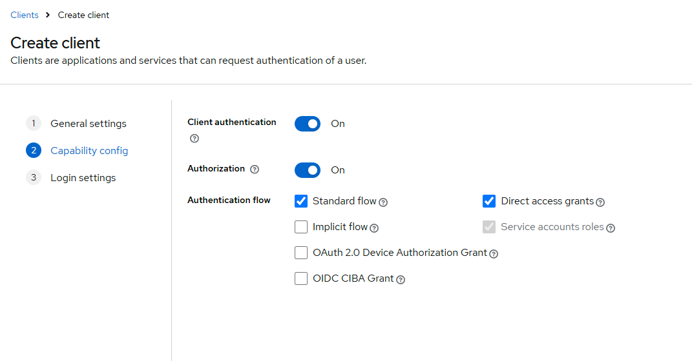
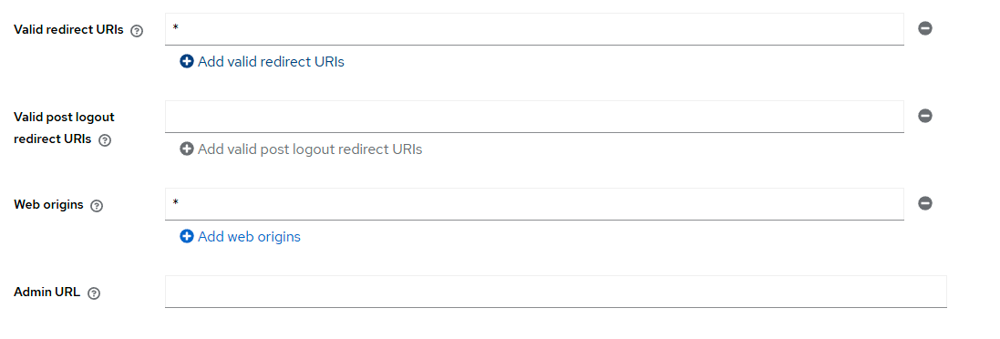
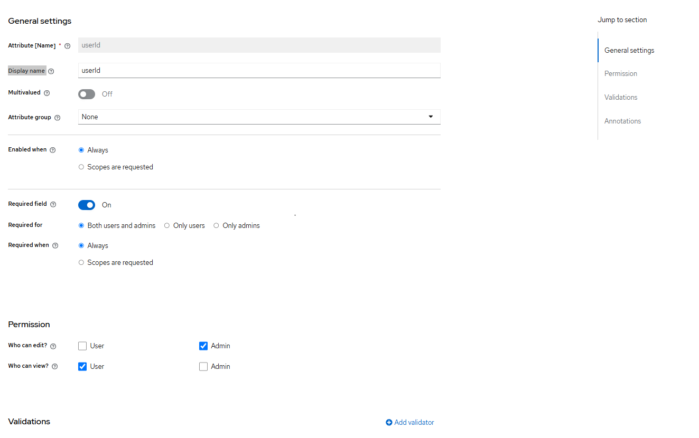
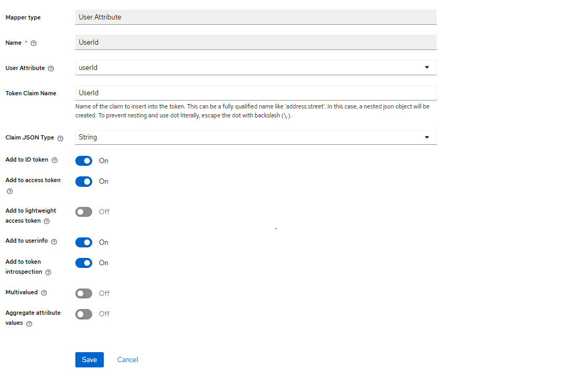

# keycloak documentation 

# client for backend 
 - bandit-games-backend 
- 
- 

# user 
 - player 
 - dev

# realm roles for player and AliStartedTalkingToGirls 
 - LobbyManagement 
 - FriendsManagement 
 - GameAndEvents

# realm roles for dev 
 - dev 

# UserId for the user 
 - first go to the realm setting and go to the User Profile Tab 
 - click create Attribute 
 - Attribute [Name]  = userId
 - Display name = userId 
 - and select the same options in the image below 
 - 

# now go to the client and click on the bandit-games-backend 
-  once your there click on the bandit-games-backend-dedicated 
- after that click add mapper select by configuration 
-  scroll down and select User Attribute 
-  now all you have to do is insert these value 

# now if you go to the user and click any user you should be able to see a user id 
 - insert any UUID value 
