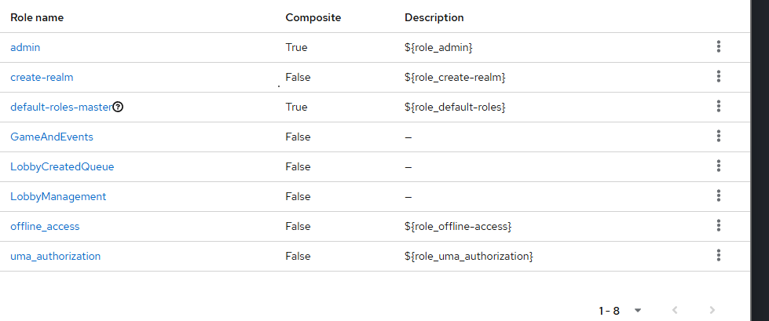
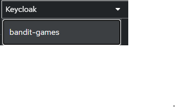
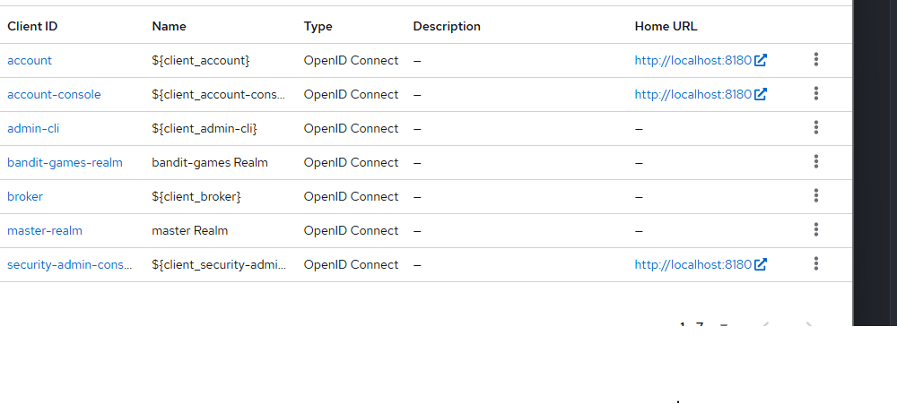

# first create these roles in the image 

# than create two user 
# dev 
# and player 
# give the player all the roles except the dev  

# give the dev user dev role 

# the password for both user
# is the name player password: player 
# dev password: dev 

#################################
# the realm name is this 

##################

#client 
# create the bandit-games-realm 

